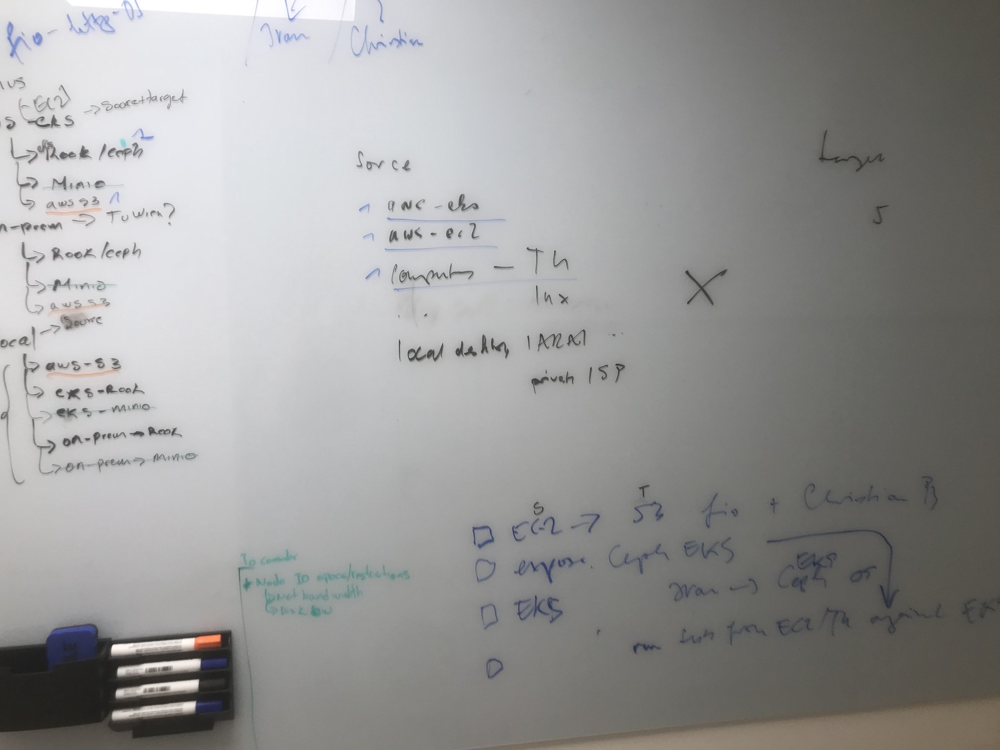

Full Cartesian product, prioritized.

Procedures
----------
- fio-http (Luis)
- python plain (Christian)
- full benchmarking (Ivan)

Sources
-------
- aws-ec2 (https://aws.amazon.com/ec2/instance-types/)
    - m4.10xlarge 	40 	160 	EBS-only 	4,000 	10 Gigabit -> reflecting what we have at the institute
    - m4.16xlarge 	64 	256 	EBS-only 	10,000 	25 Gigabit -> reflecting Infiniband
- aws-eks
- compute TU
- compute lnx
- local desktop @ IARAI
- local deskopt @ local ISP

Target object storage
---------------------
- aws-s3
- tu ceph object storage
    - Volume Type: Provisioned IOPS SSD (io2)
    - Size (GiB) 500
    - IOPS: 3000
- eks-rook-ceph
- eks-minio
- on-prem-rook-ceph
- on-prem-minio
