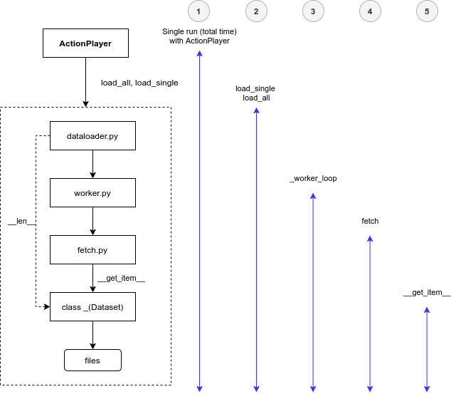
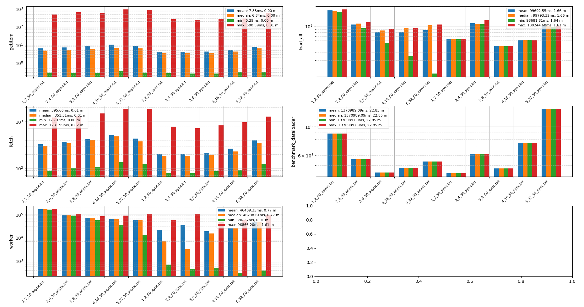
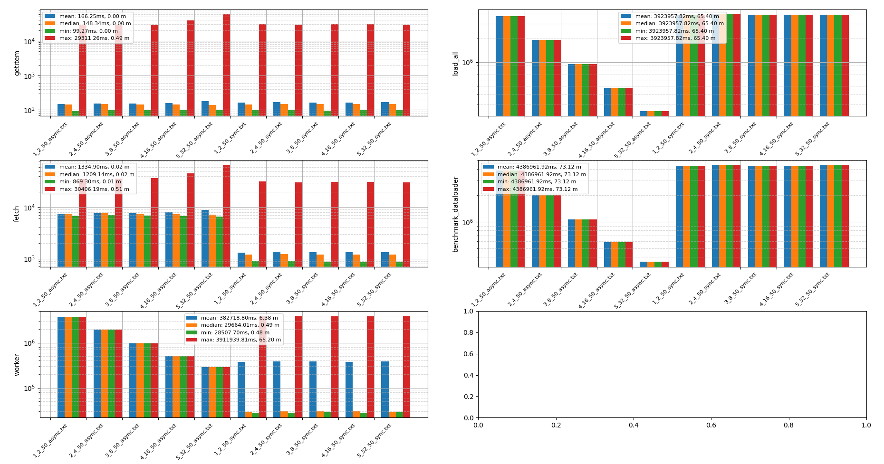
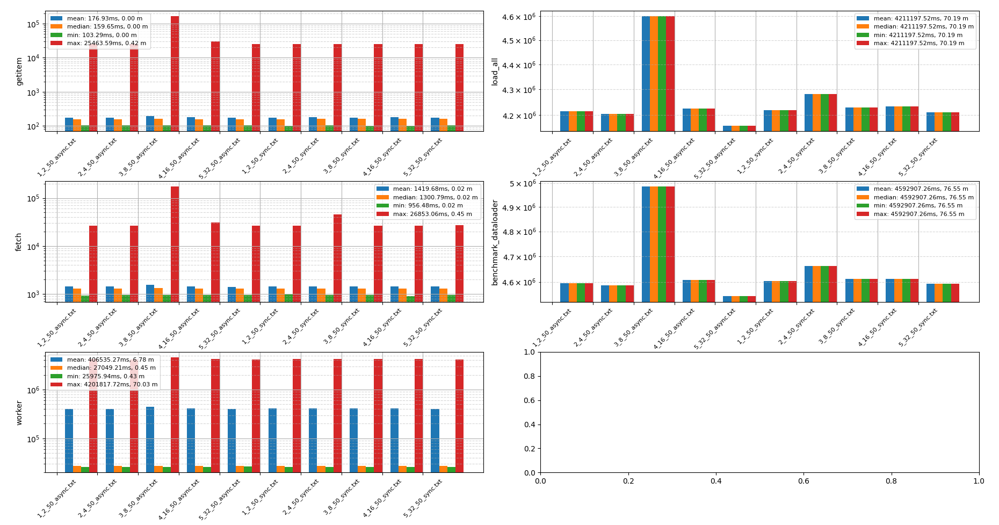

## Storage Benchmarking

Work in progress...

Use as:

`python3 main.py -a s3`

or to see help:

`python3 main.py -help`

## Activate conda environment @lnx-slim-2

 1) `conda-bash`
 2) `conda env create -f environment.yml`
 3) `conda activate storage-benchmarking`

If using `tu-` server with A100:

`conda install pytorch torchvision torchaudio cudatoolkit=11.1 -c pytorch -c nvidia`

## Pre-commit checkup

 `pre-commit run --all`

## Run experiments

Use the provide bash script:

```buildoutcfg
$ cd src

$ ./run.sh
```
By default, the script uses `s3` storage, however, it can also test `scratch` storage. To change this change `DATASOURCE='s3'` to `scratch`.

## `IndexedDataset`

The dataset classes inheriting from `IndexedDataset` are supposed to have json index file with the file paths in them and the dataset.
For instance, `index-s3-val.json` for the validation set of imagenet looks like this in the `iarai-playground` bucket:
```json
[
   "scratch/imagenet/val/ILSVRC2012_val_00000001.JPEG",
   "scratch/imagenet/val/ILSVRC2012_val_00000002.JPEG",
   "scratch/imagenet/val/ILSVRC2012_val_00000003.JPEG",
   "scratch/imagenet/val/ILSVRC2012_val_00000004.JPEG",
   ...
]
```
Similarly, for a local `IndexedDataset`, the bucket corresponds to a local root folder and the paths would correspond to the relative paths under that root folder.

Apart from the index file, we do not want the dataset interface to depend on any particular file format for the specification of the S3 endpoint.
(We might want to get rid of that dependency as well?)
Hence, we can instantiate like this, passing the file location to download the index file to and reading other parameters (aws credentials, bucket name and index file download url) from a json file:
```
s3_dataset_configuration = json.load(open("s3_dataset_configuration.json"))
s3_dataset = S3Dataset(index_file=Path("index-s3-val.json"), **s3_dataset_configuration)
```
Here, `s3_dataset_configuration.json` looks like this:
```
{
  "aws_access_key_id": "XXX",
  "aws_secret_access_key": "XXX",
  "bucket_name": "iarai-playground",
  "index_file_download_url": "s3://iarai-playground/scratch/imagenet/index-s3-val.json"
}
```
Notice that if we do not pass credentials directly, `boto3` will look them up in the standard locations according to https://boto3.amazonaws.com/v1/documentation/api/latest/guide/credentials.html.
However, this files give us the flexibility to use custom s3 locations flexibly with relying on a central aws configuration and make these configurations shareable.


## Analysis

This section briefly describes a _top-down_ approach to benchmarking storage, where the top is the data loading code, while at the bottom
is physical reading of the file from a storage device (local or remote (which then also includes network time))

`ActionPlayer` class is used to pack different benchmark-able actions into a sequential pipeline. In addition to it,
`MPActionPlayer` is used for the same purpose, however, it uses `subprocesses`. For instance, given the task of downloading
1000 images using a dataset with 8 workers, it will split the given 1000 images into "batches" of 8, and use `multiprocessing` pool (`starmap`) to execute the action.

 - **getitem**, bottom most function (`dataset.__getitem__`) in charge of loading the data item (in this case an image) from storage device, i.e. scratch drive
 - **fetch**:
   - next function on the way to the top (overriden `fetch.py` `_MapDatasetFetcher.fetch` function from `torch`) which _wokers_ use to call `dataset.__getitem__`
   - original `torch` `fetch.py` with added class `_ThreadedMapDatasetFetcher` that uses `asyncio` to perform fetching asynchronously
   - in the `run.sh` this is the async / sync parameter, that also corresponds to file names in the bar charts bellow
 - **worker**, overridden `worker.py` from `torch` that can measure `_worker_loop` which spawn _workers_ that fetch the data
 - **load_all**, a local benchmarking function that uses the `DataLoader` to loop through (i.e. download, and load to GPU?) the complete dataset
 - **benchmark_dataloader**, a function that prepares the `DataLoader` and defines the experiment (i.e. repeats all the actions bellow, multiple times)

This execution order is illustrated in the following figure:



### Scratch (lnx-slim-2)

Experiment setup:
 - executed on `lnx-slim-2`
 - benchmarking with `sync` and `async` fetching (i.e. DataLoading) that also uses the `fetch.py` `_ThreadedMapDatasetFetcher`
 - for both `sync` and `async` full fetching was performed for the ImageNet validation dataset (i.e. 50k images)
 - 10 single image fetching were performed as a warmup-cycle (to rule out one-time initialization time cost)
 - `benchmark_dataloader` is used always only once, however it calls `load_all` 5 times.
   - this means that the `fetching` was repeated (and its time was measured) 5 * 50k times. That said, each function from the bottom to the top was repeated fewer times. Example output with a number of calls, where 16 workers were used:

 ```buildoutcfg
Get item 258499
Fetch 5170
Worker loop 240
load all 5
benchmark_dataloader 1
```

The bar chart shows bottom-up mean, median, min and max execution time for a given action, respectfully for `getitem`, `fetch`, `worker_loop`, `load_all`, and finally the total time for `benchmark_dataloader`.
Furthermore, the experiments are performed with `async` and `sync` `DataLoader` (explained above), and the results are grouped, using the same batch size, but different
number of workers, 2, 4, 8, 16, 32, respectfully.



### S3 (lnx-slim-2)

Experiment setup:
 - executed on `lnx-slim-2`
 - benchmarking with `sync` and `async` fetching (i.e. DataLoading) that also uses the `fetch.py` `_ThreadedMapDatasetFetcher`
 - for both `sync` and `async` full fetching was performed for the ImageNet validation dataset (i.e. 50k images)
 - 10 single image fetching were performed as a warmup-cycle (to rule out one-time initialization time cost)
 - `benchmark_dataloader` is used always only once, however it calls `load_all` only once.
   - this means that the `fetching` was repeated (and it's time was measured) 50k times. That said, each function from the bottom to the top was repeated fewer times. Example output with a number of calls, where 16 workers were used.

 ```buildoutcfg
Get item 49999
Fetch 1000
Worker loop 16
load all 1
benchmark_s3_dataloader 1
```

The bar chart shows bottom-up mean, median, min and max execution time for a given action, respectfully for `getitem`, `fetch`, `worker_loop`, `load_all` and finally the total time for `benchmark_dataloader`.
Furthermore, the experiments are performed with `async` and `sync` `DataLoader` (explained above), and the results are grouped, using the same batch size, but different a
number of workers, 2, 4, 8, 16, 32, respectfully.



### S3 (tu-fat-3)


