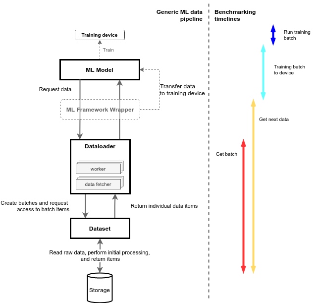
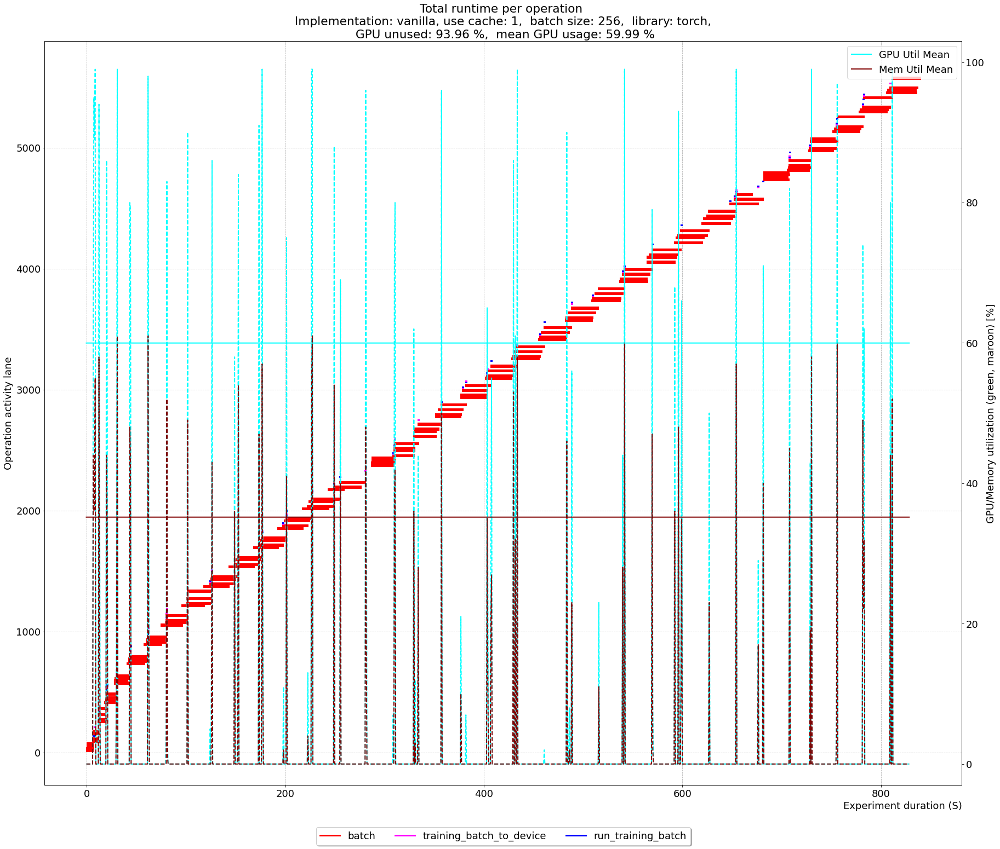
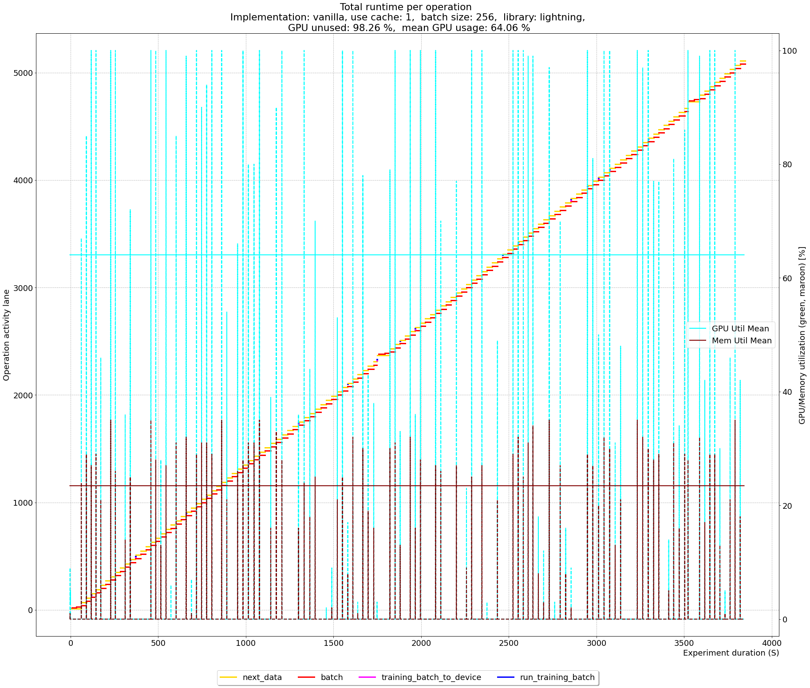

# Data loading 1: It’s inefficient, right?

## Introduction

In the era of data and hardware-accelerated machine learning (ML), profiling machine learning code is the starting point for achieving the best performance. Regardless of whether one uses CPUs, GPUs, even TPUs or something just around the corner, profiling highlights the weak points of one’s implementation, and to put it figuratively, it’s an x-ray of one's implementation. 

Modern ML frameworks mostly come with profiling options in one shape or another, allowing its users to monitor a variety of parameters, e.g. GPU/CPU utilization, system memory or GPU memory utilization, power consumption, etc. However, one of the most interesting metrics that should capture overall performance is training throughput, which is given by the number of processed training samples per second.  At the time of writing, PyTorch, Lightning and Ignite offer a lot of profiling tools (with very fine granulation, to the point of the execution time of particular functions), however, there isn’t an overall, end to end metric, as we suggest here. With higher training throughput, the goal is to reduce the GPU idling time, and not just keep it busy, but at the same time highly utilized. 

To further elaborate on this motivation, consider how ML teams nowadays operate. Mostly, engineers compete for GPU resources and want their jobs to be scheduled as soon as possible. Meanwhile, others need to wait for existing jobs to finish before new jobs are taken in. In simpler form, first come, first serve, and it continues like this while there are still resources to hand out. Therefore, the ML experiments should reserve resources for the shortest amount of time possible. While the GPU is reserved, it will not do anything else until the training is complete, and if we have poor algorithms that perform a lot of CPU to GPU memory copying or bad data handling, the GPU will mostly be idle, while being locked for other jobs. 

Furthermore, it often happens that multiple users use the same data, and when training, this data is replicated in the ML platform, copied around for different users taking up storage and increasing the total runtime of the training process due to data handling overheads. Once the training is complete and results analyzed, the redundant data often sits at multiple locations as dead weight. Therefore, along with good practices, there must be engineering approaches to deal with the aforementioned issues. 

In this blog series, we will focus on multiple metrics, and we will tear down the entire machine learning process, however, the big picture is to focus on the throughput. We will address having data locally, and remotely while using a [ResNet-18](https://arxiv.org/abs/1512.03385) architecture for benchmarking purposes, and train on the ImageNet dataset. For context, ResNet-18 is a convolutional neural network that is 18 layers deep and it often serves as a benchmarking model. In Torch and Lightning, it can be loaded, pre-trained on more than a million images from the [ImageNet](https://www.image-net.org/) database.

Having said that, we will focus on those two frameworks, [Torch](https://github.com/pytorch/examples/blob/master/imagenet/main.py) and [Lightning](https://github.com/PyTorchLightning/pytorch-lightning/blob/master/pl_examples/domain_templates/imagenet.py) (which is a more flexible higher-level API that wraps Torch), using the standard implementation of ResNet-18 and the standard set of parameters available on GitHub, explained in detail later in the article. 

To provide a more comprehensive, and hands-on example of what we are dealing with here, we worked out a simple, and quick benchmark to provide some data. 

## Quick test

Let’s consider an unmodified implementation, which from here onwards we will refer to as vanilla implementation, of the aforementioned ResNet-18, implemented via Torch and Lightning. We used a single Nvidia Tesla V100 (SXM2-32GB), and already mentioned ResNet-18 implementations, out of the box, come with the following parameters: 
- Batch size: 256
- Workers: 4
- Learning rate: 0.1
- Weight decay: 0.0001
- Max epochs: 90

However, to shorten the training time, we reduced the number of training samples to 15.000 and the number of epochs to 20. This should provide a meaningful hint about the training time, GPU, and memory utilization that we are currently focusing on, rather than model accuracy itself. While running the experiment we measured total runtime, GPU utilization, and its memory utilization, and the following table shows the results:

| Run | GPU util. [%] | GPU mem. util. [%] | ML lib.   | Runtime [S] |
| --- | ---           | ---                | ---       |-------------|
| 1   | 59.00         | 35.32              | Torch     | 8289.91     |
| 2   | 61.00         | 23.68              | Lightning | 38463.34    |

Source: experiments/motivation/InitialRun.ipynb

It seems that the native implementation in Torch uses more of the GPU memory and performs the experiment in considerably less time than Lightning implementation. However this might have to do with configuration, rather than anything else, but, there are some interesting questions one can be concerned with: 
- What type of data was used, and was there any preprocessing?
- What type of storage was used?
- How were the time, GPU utilization, and memory measured, does it include data handling?
- What are the training bottlenecks and overheads associated with such a large difference in the training runtime?
- Let’s address those questions, one by one.

### What type of data was used, and was there any preprocessing?

As previously mentioned the model uses ImageNet, which contains images with dimension 469x387 that are preprocessed before training. After each data item, i.e. an image is fetched, the preprocessing consists of cropping to the dimension of 224x224, horizontal flip, converting to tensor, and normalization. 

### What type of storage was used? 

The table above is created using Amazon’s S3 object store, where the ImageNet training set of 50.000 images is downloaded. Since the data is on a remote server, the training runtime also includes the time to request, find and fetch the image, before preprocessing it and feeding it into the model. Later on, we also show a model with a remote object store performing against the same model with a local data store.

### How was the time, GPU utilization and memory measured, does it include data handling?

To answer this question, we need a deeper understanding of the Torch data flow. The following image illustrates the data pipeline. On the left-hand side, it displays the machine learning pipeline elements, while the right-hand side shows the name of a set of elements that we are measuring. These are tags that show which pipeline elements on the right side are included in the measurement.

From top to bottom, the machine learning model requests a data item from a Dataloader, a class in charge of loading batches. It does so directly, like Torch, or through a wrapper like Lightning, that performs some additional steps. The request is made with the `__next__` function, which is triggered by the main training loop. Then, the `Dataloader` class, depending on the training parameter, uses a single or many instances of the `Worker` class in order to fetch training batches. Usually, we have more than one worker, so batch fetching is performed in parallel. Workers use Fetchers that access individual training items through a Dataset, collate training items if necessary and finally assemble them into a batch. The Dataset class, however, describes how to access and deal with individual items. 
With respect to the question at hand, the aforementioned procedure of finding, reading, and preprocessing happens in the Dataset class. It usually has access to raw data, directly from the storage, and therefore, before looping through data items, the data items are read into memory, which can take a considerable amount of time. So, for the experiment at hand, we created an index file of all the images, which allows faster data retrieval from the object-store. This is particularly useful when using a remote object-store. 
Once an individual data item is retrieved, it is transformed and cropped to the correct size and format and passed from the Fetcher to the Worker, where the batch gets assembled. Once a batch is complete, it is returned to the training loop through the `__next__` function. If a device, other than the CPU is used, the batch is first transferred to the training device and then goes through the forward pass. 
The right-hand side of the image shows four time tags; _Get batch_, _Get next data_, _Training batch to device_, and _Run training batch_. _Get batch_, and _Get next_ data represents the time necessary to fetch batches necessary to start the training process, while the main difference between those is that the former is used by native Torch implementation, and the latter is used by the Lightning implementation. _Training batch to device_ represents the time to transfer the training data to the training device, and finally, the _Run training batch_ represents the training time on a given batch.
The original Torch, Lightning, and ResNet-18 (`imagenet.py`) is modified to log the described time tags, while the GPU utilization and memory are logged on an independent thread, with 2 Hz frequency, i.e. twice per second. 

### What are the training bottlenecks and overheads associated with such a large difference in the training runtime?

With respect to the described time tags, the following figure displays an experiment with a given configuration, where the x-axis represents time in seconds, while the left y-axis represents the function activity (i.e. the time tag), and the right y-axis represents GPU utilization and its memory.  As the actual experiment took a while, the figure below doesn’t show the full runtime, but just the initial 800 seconds, which is roughly equivalent to two epochs. The following image refers to the Torch implementation.

Source and data: [src/benchmarking/experiments/motivation/InitialRun.ipynb](src/benchmarking/experiments/motivation/InitialRun.ipynb)

In addition to the previous, the following image shows the runtime of the Lightning implementation with the same configuration, displaying roughly the initial two epochs. Notice here, that for Lightning we have an extra function called _next_data, which is specific to that framework. 

Source and data: [src/benchmarking/experiments/motivation/InitialRun.ipynb](src/benchmarking/experiments/motivation/InitialRun.ipynb)

Regardless of the implementation, one can instantly notice several peculiarities, besides the runtime, and implementation (to avoid the confusion, notice that x-axis range is not the same, so the second experiment only appears denser):
- The GPU utilization and memory (shown in cyan and maroon, respectively) aren’t used continuously, but in discrete spikes. 
- The operation color that is dominant is red, and it represents the time necessary to acquire the training batch, i.e _Get batch_.
- Cyan and blue operations which respectively represent _Training batch to device_ and _Run training batch_ are almost indistinguishable.
- As the experiment uses 4 workers, it’s evident that batches are acquired in parallel as red lines seem to be in parallel (it’s easier to notice it on the first image). However, a deeper dive into the code shows that the [implementation](https://raw.githubusercontent.com/pytorch/pytorch/master/torch/utils/data/_utils/fetch.py) of the \pycode{fetcher} collects batch items sequentially. The 4 batches become ready almost at the same time and are immediately consumed by training (the GPU peaks). Although data fetching starts immediately over again,  fetching the whole next batch takes a long in the remote setting as the `fetcher` collects batch items sequentially. The Torch implementation seems to be based on the assumption that fetching time is negligible. (So raising the prefetch factor would not help either, only increasing the number of workers, and increasing the `batch_size` would make the problem worse.)

With this, one could conclude that the majority of the total training time is consumed by the data handling process, rather than training itself. Since the data is on the remote AWS S3 object store, the _Get batch_ also includes the time to download the data item, which can, depending on the network, increase the experiment runtime. The following table shows how the GPU utilization, memory usage, and the experiment runtime change depending on our data source.

| Run | GPU util. [%] | Memory util. [%] | Storage | GPU unused [%] | ML lib. | Runtime [S] | Throughput [img/S] |
| --- | ---   | ---   | ---    | ---   | ---       | ---      | ---   | 
| 1   | 64.20 | 38.16 | AWS S3 | 94.93 | Torch     | 8289.91  | 1.80  |
| 2   | 61.57 | 22.68 | AWS S3 | 98.52 | Lightning | 38463.34 | 0.39  |
| 3   | 68.44 | 40.86 | Local  | 31.26 | Torch     | 540.47   | 27.75 | 
| 4   | 61.13 | 22.66 | Local  | 70.20 | Lightning | 1968.22  | 7.62  |

Source and data: [src/benchmarking/experiments/motivation/InitialRun.ipynb](src/benchmarking/experiments/motivation/InitialRun.ipynb)

It is no surprise that using the local data considerably decreases the runtime, however, it is also interesting to note that the performance of implementation in Torch and Lightning differs significantly, and even more interesting that more than 94% of the time the GPU is idle, when using the remote storage. 

As mentioned before, we know that each data item is accessed sequentially, regardless of the fact that workers work in parallel. Having 4 workers, therefore, means that at most, 4 data items will be fetched in parallel. This hints that there might be some modifications one could make to increase the parallelism, i.e. reduce the “red” time of getting the batch, however, the question is how close could such implementation come to the performance of local storage, while still using the remote AWS S3.  

Furthermore, would that implementation also increase the performance of the model using the local storage and GPU idling as much as possible? 

## Conclusion
 
In this section we extended the current Torch and Lightning libraries with additional logging that can provide us with a detailed picture of GPU utilization, GPU memory utilization, function calls during the training and data fetching, as well as their runtime. With this, several curious implementation issues were highlighted, that we will address in the subsequent sections. Focusing on the experiment runtime and loaded images per second, these are:

- While Lightning is a wrapper for Torch, its performance is significantly poorer than that of Torch. 
- The GPU seems to be idle (in some cases up to 98\% of time), for the most part of the experiment. Not only for using remote storage, but local as well. 
- Using remote storage and local storage also makes a great difference in performance. 
