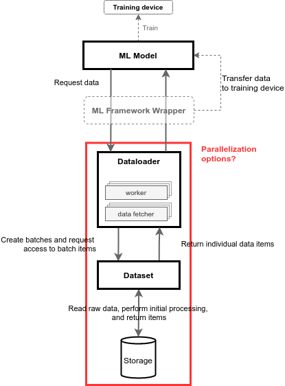
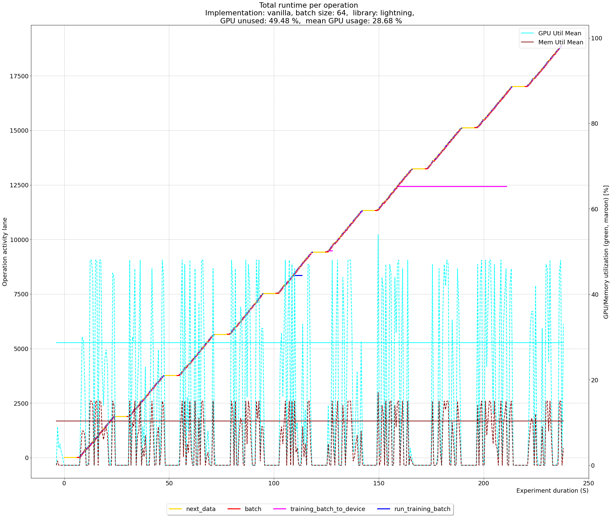
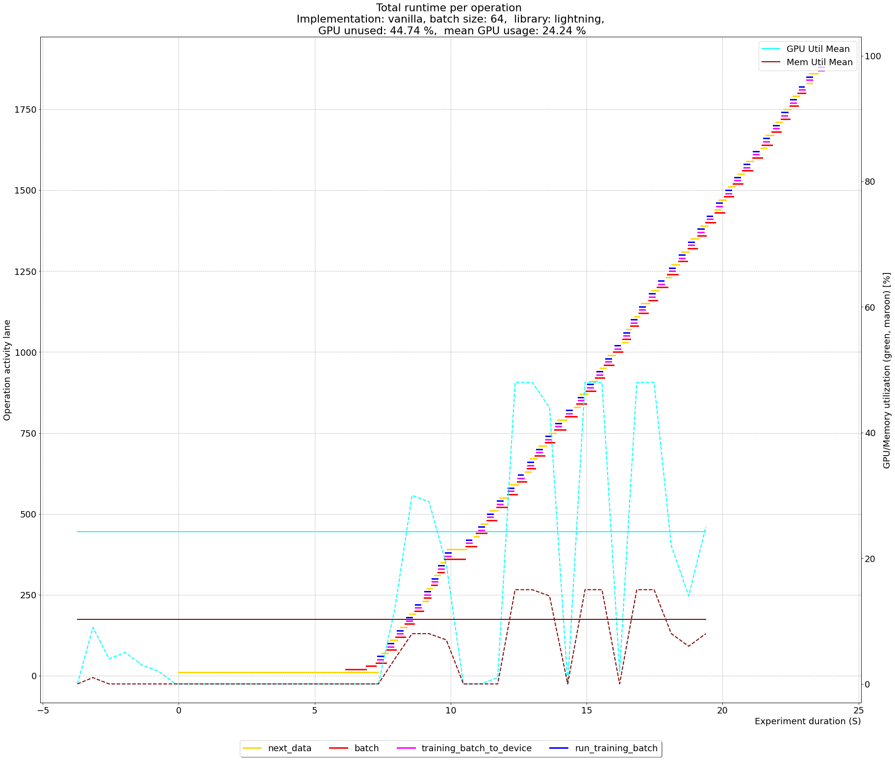
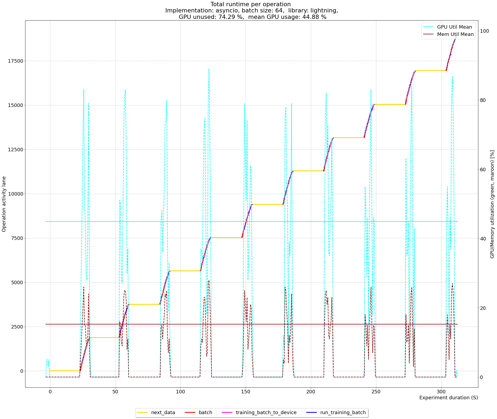
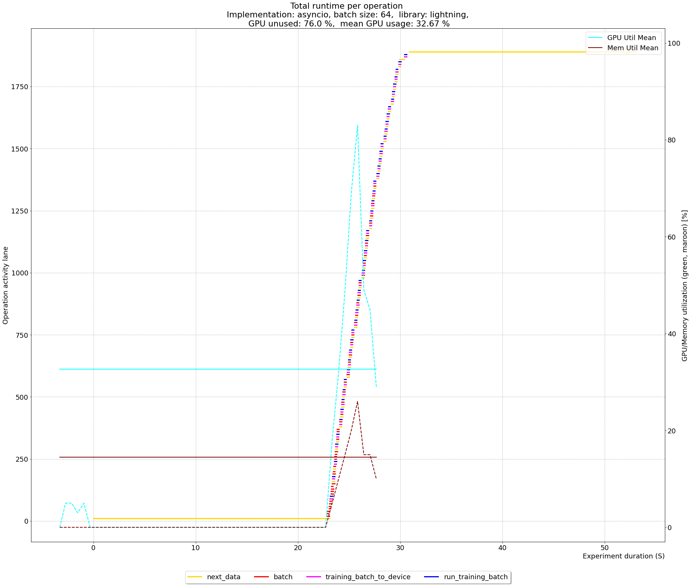
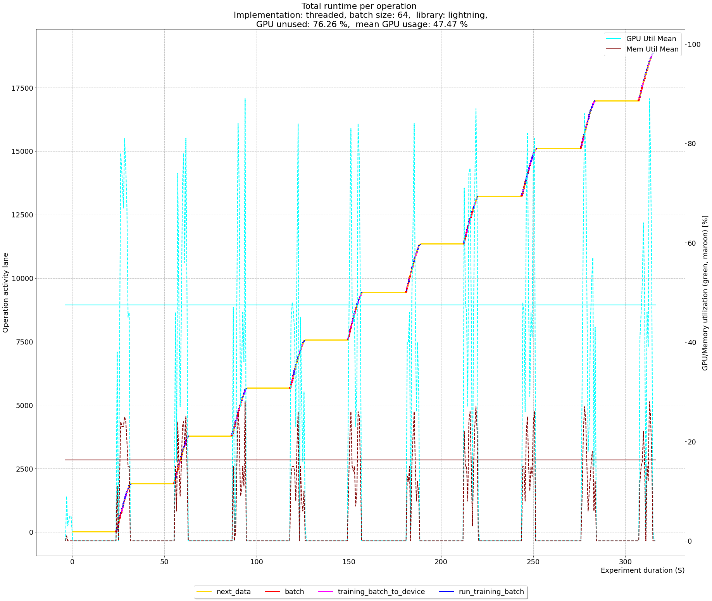
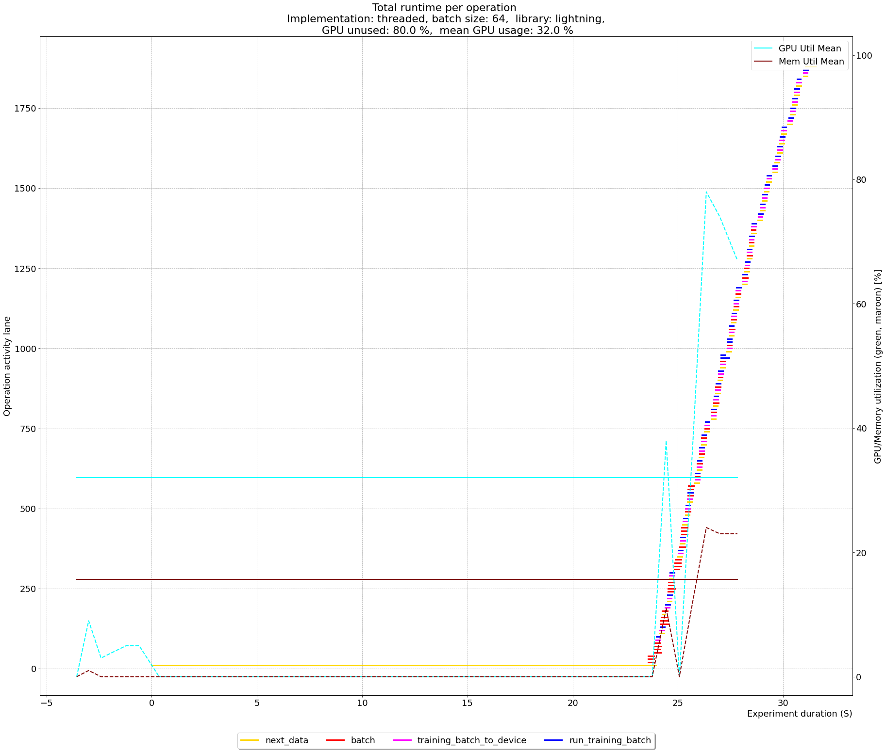
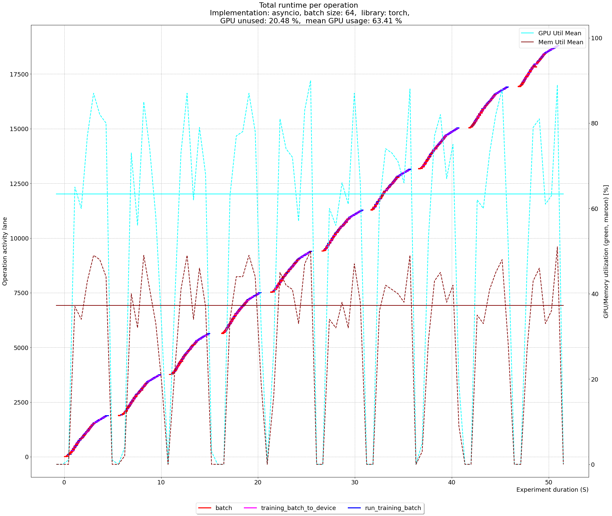

# Data loading 2: Let’s parallelize! 

We’ve demonstrated that while using the ResNet-18 implementation with pure Torch, the majority of training time is used for data handling while the GPU is idle. This is even more evident when using a remote data source, and since we want to increase the performance of using remote storage, we will explore whether the data loading pipeline could be improved so that it can be comparable to local storage. 

Considering the data pipeline shown in the image below, there are several options that should be considered for improvement, i.e possible bottlenecks.

The image could be roughly decomposed into three parts; the machine learning model, the machine learning framework, and the Dataloader, which is part of the framework. Furthermore, Dataloader can be decomposed into four parts, Dataloader itself, Worker, Fetcher, and Dataset. To find a bottleneck that could help us improve the throughput for ML models using remote storage and decrease the experiment runtime, here are several considerations:
- The machine learning model itself - for our experiments, i.e. benchmark we use the same ResNet-18 model. That said, the model is an unlikely candidate for fine-tuning in order to get better performance. But, more importantly, it is not practical to suggest model modifications in the long run, as it needs to be decoupled from the data source, and the machine learning engineer shouldn't be burdened with that extra task, as we see it as a task for the framework itself.
- ML Framework / Wrapper
  - `Dataloader`, already leverages parallelization through the selection of multiple workers. The `Dataloader` creates a `Process` and attaches a `Worker` to it, which then starts loading data items. The `Dataloader` uses indexing to point to individual data items, therefore in its context, a batch is simply a list of indexes. Before the worker process starts, the `Dataloader` clears its index list, loads it, and sends it to individual workers using a _task queue_. Finally, when it obtains the list, it is then forwarded to the `Fetcher`.
  - `Worker` continuously checks the task queue for index lists and forwards those lists to the Fetcher. 
  - `Fetcher`, loops through the list of indexes and uses the `Dataset` `__getitem__` function to obtain single items. It does this sequentially, and once all the items of the batch are fetched, it returns the result to the _worker_, which then returns the result through a result queue, which then returns the data to the ML model through the `__next__` function.
  - `Dataset` - is usually implemented by the user, and the most important function is the `__getitem__` which fetches a single item. Since the Dataset implementation falls on the user, it’s not a good candidate for introducing any changes, and it is a topic on its own. 

As we are also considering the data from a remote source, this introduces networking overhead in which each element needs to be requested and delivered back to the training machine. Furthermore, since we don’t want to change the Dataset that is in charge of this process, the best implementation candidate to reduce (networking) overhead is the Fetcher. It receives the indexes of all the batch items, and then collects them sequentially, however, if this process is parallel, we could reduce the total time to collect all the items. 

## Enter parallelism!

Our implementation of the Fetcher introduces a new layer of parallelism. As it  receives the list of items, it starts the downloading process of remote items in parallel. Once all of them are collected, the batch is returned. In addition to this, by increasing the prefetch factor, the idea is to have the download process always running in the background, even collecting batches while training, so that once the training starts, it will always have a sort of buffer to fetch the data from. In theory, this should add some initialization overhead to start out the _prefetching_. 

To perform the experiment, we modified the `fetch.py` of Torch, which is part of `torch.data._utils` package. To the existing `_MapDatasetFetcher` class which works sequentially, we’ve added two new classes:
- `_AsyncMapDatasetFetcher`, which uses the Asyncio library to create an `asyncio.Queue` that gets populated with _fetch-tasks_. Each aforementioned index gets its _fetch-task_, and then the asynchronous fetching starts. Once all data items are loaded, the batch is assembled and returned to the `Dataloader`. From this point onward, we will refer to this modification as **async implementation**.
- `_ThreadedMapDatasetFetcher`, uses `Threading` to parallelize item downloads. From this point onward, we will refer to this modification as **threaded implementation**.

As both implementations allow us to fetch items in parallel using the [ThreadPoolExecutor](https://docs.python.org/3/library/concurrent.futures.html), it should be interesting to see which implementation will perform better. The changes are introduced to the `worker.py` and `dataloader.py`, so now, we can use parameters to select which `Fetcher` is used. For a more intuitive understanding and straightforward usage, the parameters are set in the same way as a number of workers, in the `Dataloader` constructor:
- _Fetch implementation_, refers to the choice of the fetcher implementation which can be vanilla, threaded, and async. 
- _Number of fetch workers_, both solutions use a ThreadPoolExecutor to execute fetching tasks. This parameter refers to the maximum number of threads the ThreadPoolExecutor can use to execute tasks asynchronously.

Before proceeding with a new benchmark, there is another concern that needs to be addressed. For the `fetcher`, it is important that the batch can be reassembled properly so that its items are returned in the correct order (to the Dataloader). By introducing parallelism in the fetcher, if it happens that one fetch request gets delayed a bit, the training start is postponed until that item arrives, and the batch can be assembled. Though different, it is similar to sequential fetching, but with potentially bigger delays, so this is a concern to keep in mind. 

Furthermore, we can even go deeper, beyond fetching data items in parallel, we can also consider fetching batches in parallel. Implemented in [`worker.py`](https://github.com/pytorch/pytorch/blob/master/torch/utils/data/_utils/worker.py#L260) one can notice that batches are downloaded one by one, hence sequentially. The question here is, _how far down the rabbit hole are we willing to go_? - Let's not get into rhetorical questions, and introduce another level of parallelism.

For the threaded implementation, we made a modification that collects multiple items in the batch. To illustrate it better, consider the following example. We have a batch of 8 elements, normally, we would create 8 workers and fetch them in parallel. However, if in total we have 10 batches, the two remaining ones will be accessed sequentially. For threaded implementation, such implementation is more straightforward, therefore we modified it with an additional thread pool. This way, if we consider our example with 24 elements, we would be able to take more into the _download pool_, i.e. the amount corresponding to the new thread pool we suggest here. Now, in addition to downloading batches, elements of the batches are downloaded in parallel. As the items are coming in, batches are reassembled. But, there is a familiar caveat to consider, if one of the items is late, it can delay batch assembly, and also other batches, since they need to be processed in a certain order. To have a reference point, the described pool will be only added to the threaded implementation. The parameter determining this pool size is called _batch pool_.

Considering that one of the previous experiments took more than 38000 seconds to finish (roughly 10.5 hours), since we are experimenting with a lot of modification, in the interest of saving time, we limited the dataset to 3000 images and 10 epochs. Later on, once we get on a right path of performance, longer experiments with more data are going to be scheduled.  Since we are comparing the vanilla implementation with our threaded and asyncio solutions, the limited dataset should outline the possible bottlenecks and highlight improvements.

In the following experiment, we benchmark the vanilla implementation on the remote AWS S3 object store, and local storage, with our new implementation of the `fetcher`. We used the following parameters:

| Parameter         | Value                |
|-------------------|----------------------|
| num-fetch-workers | 16 (not for vanilla) |
| dataset-limit     | 3000                 |
| batch-size        | 64                   |
| prefetch-factor   | 4                    |
| max-epochs        | 10                   |
| batch-pool        | 256                  |
| num-workers       | 4                    |

The following table shows the result for the Torch implementation, highlighting the rows with the largest throughput per storage. Since we’ve changed the parameters of the experiment too much compared to the motivational experiment, we cannot compare previous results to the ones presented here. However, later on, we will run the original experiment with our modifications and compare. 

| Run | GPU util.  [%] | Memory util. [%] | Storage | GPU unused [%] | Impl.    | Runtime [S] | Throughput [img/S] |
|-----|----------------|------------------|---------|----------------|----------|-------------|--------------------|
| 1   | 44.17          | 25.66            | AWS S3  | 82.39          | vanilla  | 272.51      | 11.01              |
|  **2**  | **36.27**          | **24.55**            | **AWS S3**  | **75.78**          | **asyncio**  | **227.24**      | **13.20**              |
| 3   | 45.14          | 28.33            | AWS S3  | 79.15          | threaded | 297.53      | 10.08              |
| 4   | 50.81          | 22.04            | Local   | 21.33          | vanilla  | 62.39       | 48.08              |
| **5**   | **63.40**          | **28.30**            | **Local**   | **20.48**          | **asyncio**  | **50.87**       | **58.98**              |
| 6   | 61.52          | 14.59            | Local   | 55.33          | threaded | 98.80       | 31.98              |

Regardless of this, we have results from the vanilla implementation, and we can see that considering throughput, for AWS S3 remote object store our asyncio implementation is the best (16.6% better than the vanilla). It also performs better when using local storage (18.4% better than vanilla). Furthermore, comparing the utilization of the GPU, the runs with the best throughput had the lowest idling time of the GPU. Using local storage, it also had the highest GPU utilization, while for AWS S3, the threaded implementation on average had the highest GPU utilization. The same observation can be made for memory. 

Furthermore, for the Lightning, we performed the experiment with the same parameters, and the results are shown in the following table.

| Run | GPU util.  [%] | Memory util. [%] | Storage | GPU unused [%] |   Impl.  | Runtime [S] | Throughput [img/S] |
|-----|:--------------:|:----------------:|:-------:|:--------------:|:--------:|:-----------:|:------------------:|
| 1   | 29.68          | 10.33            | AWS S3  | 96.36          | vanilla  | 3648.23     | 0.82               |
| **2**   | **39.67**          | **13.54**            | **AWS S3**  | **78.27**          | **asyncio**  | **431.67**      | **6.95**               |
| 3   | 42.04          | 14.75            | AWS S3  | 80.41          | threaded | 436.89      | 6.87               |
| **4**   | **28.68**          | **10.36**            | **Local**   | **49.48**          | **vanilla**  | **237.01**      | **12.65**              |
| 5   | 44.88          | 15.23            | Local   | 74.29          | asyncio  | 311.50      | 9.64               |
| 6   | 47.47          | 16.27            | Local   | 76.28          | threaded | 315.06      | 9.52               |

With AWS S3 object store we get the best performance using asyncio implementation, while threaded implementation has similar performance. Compared to vanilla implementation, asyncio has 88.2% higher throughput, but for local storage, vanilla implementation has higher throughput, 23.7% better to be precise. Again, with AWS S3, the least amount of GPU idling time was with asyncio implementation, but the highest overall utilization was with threaded implementation. For local storage, vanilla implementation had the least GPU idle time, while threaded implementation had the highest overall utilization. 
As for the batch pool layer implemented in the threaded approach, it seems that it may add no additional value to the implementation, though threaded is only slightly better than asyncio. At this moment, we cannot claim it’s due to this layer of parallelism or implementation differences of `threading` and `asyncio` libraries, which is out of the scope of this work, but might be interesting for future work. 

Considering the results shown in the previous tables it is obvious that our changes of the Fetcher significantly increased the throughput. However, the experiments also highlight two new issues:
- Why is the vanilla implementation still better for the Lightning library on the local storage?
- Why is the Torch implementation significantly better than the Lightning implementation? 

To answer those questions, we’ll have a look at the timeline plots. For the first question, we will compare timeline plots of the vanilla implementation with the Lightning library, with the asyncio and threaded implementation. Also, for the second question, we will compare timeline plots of the asyncio Lightning and Torch implementations (or in fact, any pair would do, vanilla to vanilla or threaded to threaded, in any case, Torch performs better).

## Vanilla vs asyncio vs threaded: scratch and Lightning

The following image shows the timeline of operation runtime for the Lightning library with vanilla implementation. The cyan and maroon dashed lines respectively show the GPU utilization and memory, the x-axis represents time while the y-axis shows function lanes. Each lane represents a function runtime. We can distinguish 10 epochs, and between each epoch, we see a brief pause, during which the GPU is unused. The horizontal cyan and maroon line outline the average GPU utilization and memory (respectively). It seems that between each epoch, there is a ramp-up time that takes a considerable amount of time (orange), while the red and blue which represent obtaining the batch and training seem to be intertwined (the very long purple lines are misbehaving long entries). 

For better understanding, the following image focuses on the same experiment, but zooms in on the first epoch. It can be seen that, at first, the data is requested (orange line), then after some time, two batches are fetched (red line), while two continue downloading, and the training starts (blue line). As the experiment progresses, we can see that the data is downloaded almost in parallel, which indicates multiple workers, however, the training can proceed only when all the red lines (fetching) end, i.e. when the batches are fetched. 

However, for the asyncio implementation, the gaps between epochs seem to be more distinct, even with the longer x-axis, we can notice that the request for data takes much longer, and seems to take most of the experiment time. 

Zooming in on the first epoch shows that, similarly as for the vanilla implementation, the training and data loading almost happens in parallel, however, the initial ramp-up, i.e. time from the first request, to the start of the downloading process (actual fetching) takes very long. This requires further investigation.

With threaded implementation, the problem seems to be exactly the same as for asyncio. Also, notice how the training is much steeper, and blue lines overlap, meaning that we no longer wait for all the batches to be fetched, but only for those that are needed (i.e. with the right order). When the batch of the right order is fetched, the training step can start. This is also visible for the asyncio implementation later on. 

And when zooming in on the first epoch, we notice the same issue. 

We hypothesized the issue might be due to the overhead of process creation. Upon further inspection of the code, in the [vanilla Dataloader](https://github.com/pytorch/pytorch/blob/master/torch/utils/data/_utils/worker.py#L260) the process of creating workers, creating batch indexes and populating the input queue for the worker happens in the constructor (`__init__`). To address this, we modified the `dataloader.py`. We noticed that the processes are created in the constructor, and therefore if we choose multiple workers (which, with our addition, start to download data items immediately), the object construction is blocked until the worker process(es) are created. Therefore, we introduced modifications that do not wait for all [processes](https://github.com/pytorch/pytorch/blob/master/torch/utils/data/dataloader.py#L944) to be created, but just the first one. We prime the input queue with indexes (of data items) to access, and once a single process is running, the fetching is started. 

## Asyncio Torch vs asyncio Lightning

One might also notice in previously presented experiments that there is a large difference in performance between Torch and Lightning implementation. This is odd since Lightning is a Torch wrapper and both use the same Dataloader. The following image shows operations timelines for the Torch implementation.

Operation timelines for the Lightning implementation:

Besides the longer runtime, one can notice that the time between epochs (the flat orange-red part between the steps) for Lightning implementation, is significantly larger than for the Torch implementation. Also, notice that the actual training seems to be roughly the same length.

This indicates that we have a bottleneck, we need to track down!

Conclusion
Batch pool difference
Parallelization 
Process creation
